<div align="center">



<p>
  <a href="#run-the-demo"></a>
  <a href="#how-it-works"></a>
  <a href="#results"></a>
</p>

<p>
  
  
  
  
  
  
  
</p>


<sub>Live coaching on a held-out VocalSet clip: phrase length fills the ring, the breath count rises, and the waveform marks each detected breath.</sub>

</div>

Real-time singing breath & phrase coaching in the browser. A small (~15K-parameter) causal neural network detects audible breath events frame by frame, sits on top of a frozen pitch-tracking backbone ([NanoPitch](#backbone)), and turns its output into musically useful feedback: phrase length, breath count, and live coaching messages.

---

## What it does

Most singing apps tell you whether your pitch is right. BreathCoach tells you about the *gaps between* the notes — when you breathed, how long the phrase before it was, and whether your breath support is holding up. It runs as a single-page browser app that visualizes the spectrogram, marks each detected breath, and updates phrase-length feedback live as audio plays. You can also record your own voice through the mic and get the same analysis.

The technical goal is the four-axis intersection that prior work doesn't cover:

| | Singing? | Real-time / causal? | Mic-only? | Browser-deployable? |
|---|---|---|---|---|
| Respiro-en (Interspeech 2024) | ✗ speech | ✗ non-causal | ✓ | ✗ |
| NIME 2022 wearable | ✓ | ✓ | ✗ sensor | ✗ |
| Ruinskiy & Lavner 2007 | partial | ✗ offline DSP | ✓ | ✗ |
| **BreathCoach** | **✓** | **✓** | **✓** | **✓** |

---

## How it works

```
microphone audio (16 kHz mono)
        │
        ▼
   log-mel spectrogram  (40 bands, 25 ms window, 10 ms hop)
        │
        ▼
   NanoPitch backbone  (frozen, ~333 K params)  ──▶  pitch + VAD outputs
   2× causal conv + 3× GRU → 384-d frame features
        │
        ▼
   BreathHead  (causal 1-D conv, ~15 K params)
        │
        ▼
   per-frame breath probability  ∈  [0, 1]
        │
        ▼
   PhraseTracker  (state machine, pure Python / JS port)
        │
        ▼
   live coaching signals → browser UI
```

The breath head is **causal** (no lookahead) so the same forward pass can run streaming on a live mic. It's also small and conv-only, which means it compiles cleanly to WebAssembly — the C implementation in [`deployment/wasm/breath_head.c`](src/nanobreath/deployment/wasm/breath_head.c) produces bit-identical outputs to PyTorch (within 1 × 10⁻⁶), verified by [`test_breath_head.c`](src/nanobreath/deployment/wasm/test_breath_head.c).

The phrase tracker is downstream of the model: a simple state machine with hysteresis on the breath probability + voicing signal that emits "current phrase length", "last phrase length", and category-based coaching messages.

---

## Run the demo

```bash
# 1. Create an isolated environment and install the package
python3.11 -m venv .venv
.venv/bin/pip install -e .

# 2. Provide the NanoPitch backbone (not bundled — see models/README.md).
#    Drop model.py + best.pth into models/nanopitch/ and it's auto-detected.

# 3. Start the demo — no flags, no env vars. It auto-discovers the local
#    backbone (models/nanopitch/) and the bundled BreathHead (runs/).
.venv/bin/python run_demo.py
# open http://localhost:8421/
```

`run_demo.py` is a thin launcher that puts `src/` on the import path, so it runs straight from a clone even without the editable install. If the package is installed, `python -m nanobreath.deployment.serve` is equivalent. Both accept `--port`, `--nanopitch`, `--breath-head`, and `--method`.

The demo loads 5 precomputed VocalSet clips and a pink **🎤 Record** button. Click it, sing for up to 15 seconds, and the browser uploads the recording to the local `/process` endpoint, runs the NanoPitch + BreathHead + Ruinskiy pipeline, and renders the result in the same UI.

> **Backbone note.** BreathCoach attaches to a frozen NanoPitch pitch-tracking backbone, which is a separate Smule-confidential artifact and is **not** included in this repo. Place a compatible `model.py` + `best.pth` in `models/nanopitch/` (see [`models/README.md`](models/README.md)). Any module with the same interface works — the wrapper in `src/nanobreath/model/joint.py` documents the exact attributes it expects.

---

## Reproduce the trained model

```bash
# 1. Get VocalSet (~2 GB, Wilkins et al. 2018, CC BY 4.0)
nanobreath-download --data-dir data/vocalset

# 2. Generate weak labels by running the Ruinskiy & Lavner 2007 baseline on all excerpts
python -m nanobreath.data.generate_pseudo_labels \
    data/vocalset/FULL --out-dir data/pseudo_labels --recursive --threshold 0.35

# 3. Train (this reproduces runs/v4-aug-2026-05-18/best.pth)
nanobreath-train \
    --label-dir data/pseudo_labels \
    --nanopitch-checkpoint $NANOPITCH_CHECKPOINT \
    --output-dir runs/v4-repro \
    --epochs 150 --batch-size 8 --seq-len 1000 --hidden 8 \
    --loss focal --focal-gamma 2.0 --focal-alpha 0.25 \
    --aug-noise-std 0.2 --aug-time-mask 40 --aug-freq-mask 6 --aug-num-masks 2

# 4. Honest full-clip evaluation
python -m nanobreath.eval_checkpoint runs/v4-repro/best.pth \
    --nanopitch $NANOPITCH_CHECKPOINT --label-dir data/pseudo_labels
```

Training takes ~12 minutes on a single CPU core for 75 clips (32.8 min of audio) × 150 epochs.

---

## Results

Honest full-clip evaluation on held-out singers (val split, weak labels from the Ruinskiy baseline):

| Model | Loss | PR-AUC | Frame F1 | F1 @ 100 ms | Max prob | ECE | Notes |
|---|---|---|---|---|---|---|---|
| v2 — no augmentation | focal | 0.655 | 0.610 | 0.432 | 0.36 | — | baseline |
| v4 — augmentation | focal | 0.659 | 0.625 | 0.474 | 0.35 | **0.072** | best PR-AUC, but **never crosses 0.4** — badly calibrated |
| v4 + Platt scaling | focal + post-hoc | 0.659 | 0.625 | 0.474 | 0.69 | 0.028 | 2 params fitted on val, no retraining |
| **v8 — production** | **BCE pos-w=3 + aug** | **0.649** | **0.617** | **0.436** | **0.78** | **0.022** | natively well-calibrated; smaller PR-AUC drop is worth the sharp outputs |
| v5 — larger model | focal (hidden=16) | 0.659 | 0.623 | 0.412 | 0.40 | — | doubling head size doesn't help |

**Two findings worth noting:**

1. **Focal loss gives strong discrimination but bad calibration on this label distribution.** v4 separates breaths from non-breaths well (PR-AUC 0.66) but compresses all outputs into [0, 0.35] — frames the model predicts at 30-40% probability are actually breaths **73%** of the time. Threshold-based event extraction at any reasonable threshold misfires badly.

2. **Plain BCE with mild positive-class weighting recovers good calibration with almost no PR-AUC loss.** v8 reaches ECE 0.022 (3× better than v4) and emits sharp probabilities up to 0.78. We use it as the production model.

A simpler post-hoc fix — Platt scaling fitted on the val logits — also closes most of the calibration gap (v4 ECE 0.07 → 0.03) without retraining. Useful when the original training run is expensive to reproduce.

---

## What's still ahead

- **Hand labels.** The val numbers above are against weak labels generated by the Ruinskiy baseline. To honestly push PR-AUC above ~0.7 we need a hand-labeled gold set — typically 20–30 min of audio at frame-level is enough.
- **Cross-domain baseline.** Run the [Respiro-en](https://arxiv.org/abs/2402.00288) pretrained checkpoint on singing audio and quantify the cross-domain gap.
- **Pure-browser WASM.** The C inference is parity-tested already; what remains is compiling with Emscripten and wiring the JS bridge so the live-mic path no longer needs a Python server.

---

## Repository layout

```
nanobreath/
├── pyproject.toml                            installable package, CLI scripts
├── README.md
├── .gitignore
├── src/nanobreath/
│   ├── data/
│   │   ├── dataset.py                        WAV + .breath.json loader, log-mel
│   │   ├── download_vocalset.py
│   │   ├── generate_pseudo_labels.py         Ruinskiy → .breath.json pseudo-labels
│   │   ├── svl_to_breath_json.py             Sonic Visualizer → our label format
│   │   └── label_format.md
│   ├── baseline/
│   │   └── ruinskiy_lavner.py                Faithful re-implementation of Ruinskiy 2007
│   ├── model/
│   │   ├── breath_head.py                    Causal-conv head (~15 K params)
│   │   └── joint.py                          Backbone-coupled wrapper + loader
│   ├── feature/
│   │   └── phrase_tracker.py                 Coaching state machine
│   ├── deployment/
│   │   ├── serve.py                          HTTP server with /process endpoint
│   │   ├── precompute_predictions.py         Batch inference + spectrogram PNGs
│   │   ├── export_breath_head.py             PyTorch → JSON/binary for WASM
│   │   ├── web/                              Single-page browser app
│   │   └── wasm/                             C inference, parity test, build script
│   ├── train.py                              Focal loss + SpecAugment + full-clip val
│   ├── eval.py
│   ├── eval_checkpoint.py
│   └── visualize_predictions.py
├── tests/                                    Smoke tests
├── data/                                     local-only; gitignored
└── runs/
    ├── v4-aug-2026-05-18/                    Focal-loss checkpoint (kept for ablations)
    └── v8-bce-2026-05-19/                    Production checkpoint (BCE, well-calibrated)
```

---

## Backbone

BreathHead expects a backbone that maps a 40-band log-mel spectrogram to a 384-d per-frame feature vector. The reference implementation is [**NanoPitch**](https://github.com/Festus-Ewakaa-Kahunla) — a causal, streaming pitch tracker (2 conv + 3 stacked GRU, 333 K params total). Any module with the same interface works; see [`src/nanobreath/model/joint.py`](src/nanobreath/model/joint.py) for the exact attribute names the wrapper expects (conv1, conv2, gru1, gru2, gru3, dense_vad, dense_pitch).

Point the training and serving scripts at your backbone via the `NANOPITCH_CHECKPOINT` and `NANOPITCH_SRC_DIR` environment variables.

---

## References

- Atsumi, Y. et al. (2024). *Frame-Wise Breath Detection with Self-Training.* Interspeech / arXiv:2402.00288.
- Ruinskiy, D. & Lavner, Y. (2007). *An effective algorithm for automatic detection and exact demarcation of breath sounds in speech and song signals.* IEEE TASLP 15(3).
- Wilkins, J. et al. (2018). *VocalSet: A Singing Voice Dataset.* ISMIR.
- Sundberg, J. (1988). *Breathing for Singing.* Journal of Voice 2(1).
- Park, D. et al. (2019). *SpecAugment: A Simple Data Augmentation Method for Automatic Speech Recognition.* Interspeech.
- Lin, T.-Y. et al. (2017). *Focal Loss for Dense Object Detection.* ICCV.

---

## Citation

```bibtex
@misc{kahunla2026breathcoach,
  author = {Festus Ewakaa Kahunla},
  title  = {BreathCoach: Real-time joint VAD + breath-event detection for singing voice},
  year   = {2026},
  url    = {https://github.com/Festus-Ewakaa-Kahunla/breathcoach}
}
```
