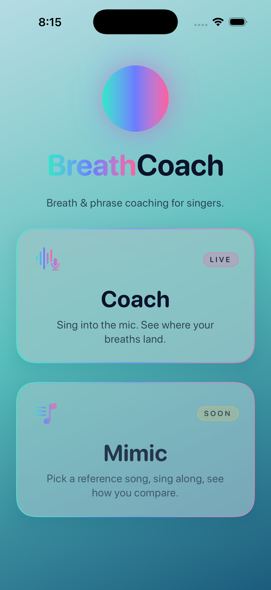
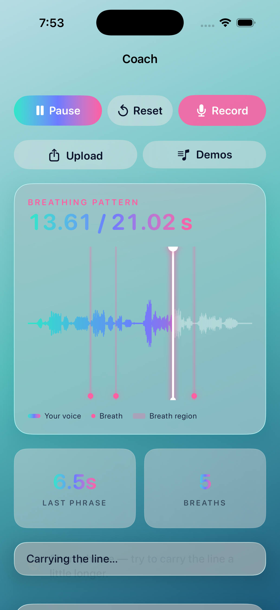
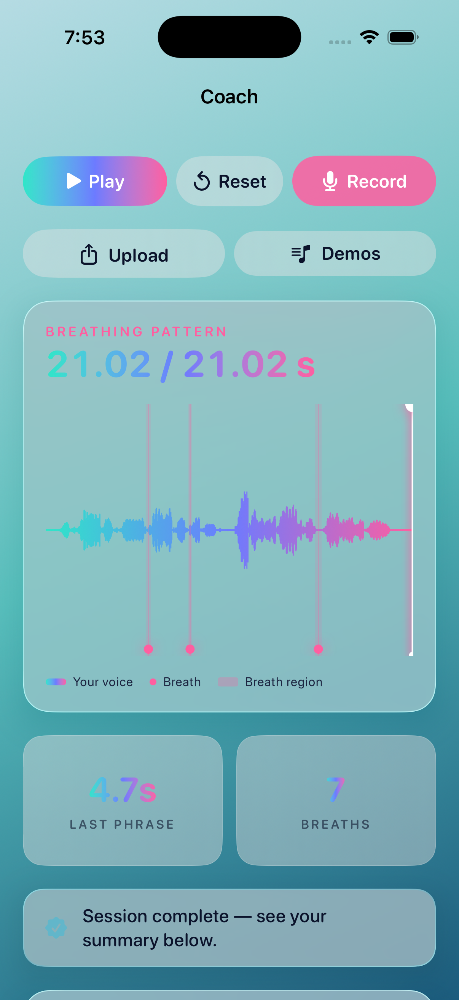
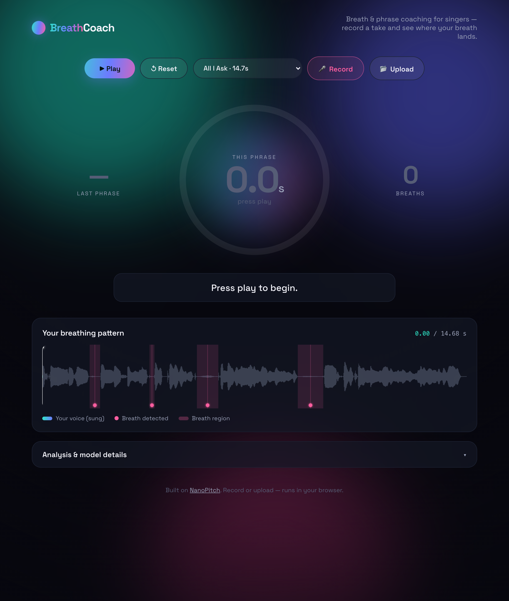
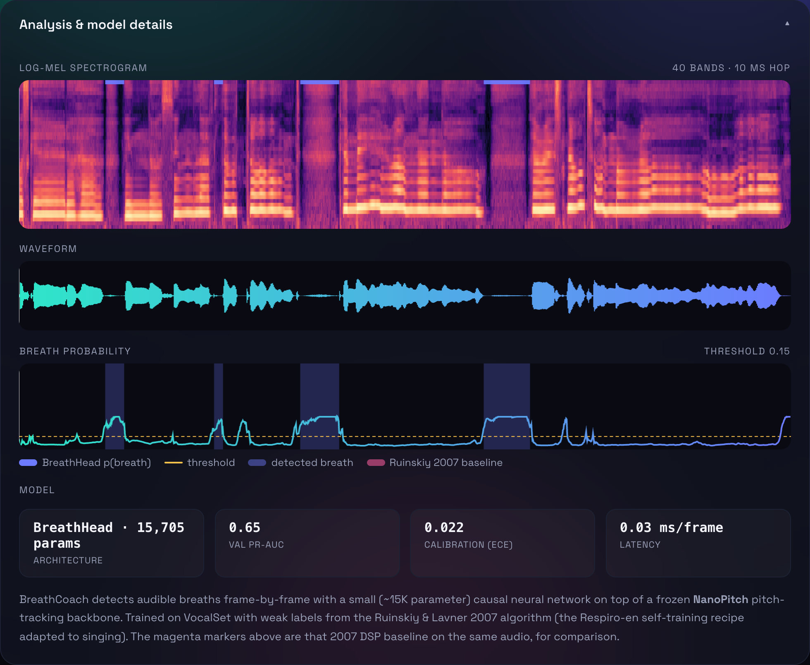

<div align="center">



<p>
  <a href="#run-it"></a>
  <a href="#how-it-works"></a>
  <a href="#screenshots"></a>
</p>

<p>
  
  
  
  
  
  
  
</p>

</div>

On-device breath detection for singing. A small causal network (~15K trainable
parameters) detects audible breaths frame-by-frame on top of a **frozen**
pitch-tracking backbone (NanoPitch), and turns the result into phrase-length
feedback for singers.

## The parts

| Folder | What it is |
|---|---|
| `model/` | The model - frozen NanoPitch backbone + trained BreathHead. Training, evaluation, CoreML export. |
| `dataset/` | The annotation tool used to build **VocalSet-Breath**. The labels live on Hugging Face. |
| `web/` | Browser demo - record or load a clip, see breaths on the spectrogram. |
| `ios/` | Native iOS app (SwiftUI). Runs the model fully on-device via CoreML. |

## Datasets

- **VocalSet-Breath** (ours) - https://huggingface.co/datasets/Ewakaa/Vocalset-Breath
- **GTSinger** (training) - https://github.com/AaronZ345/GTSinger

`dataset/annotator/` is the tool that produced VocalSet-Breath.

## How it works

```
audio ─► log-mel ─► NanoPitch [FROZEN, ~333K] ─► 384 features/frame
      ─► BreathHead [TRAINED, ~15K] ─► p(breath)/frame ─► breath + phrase feedback
```

Only the 15K-parameter head is trained. The backbone - already trained for pitch
and voicing - is frozen and used as a feature extractor. Reusing it means breath
detection learns from a small amount of labeled data, and the whole model is
small enough to run on a phone.

## Screenshots

**iOS - fully on-device**

<p>
  
  
  
</p>

**Web demo**

<p>
  
</p>
<p>
  
</p>

## Run it

**Model + web demo**
```bash
cd model && pip install -e .     # installs the `nanobreath` package
cd ../web && python serve.py     # http://localhost:8421
```

**iOS**
```bash
cd ios && xcodegen generate      # then open BreathCoach.xcodeproj in Xcode and Run
```

## License & weights

- **Code & model** - CC BY-NC-ND 4.0 (see `LICENSE`).
- **Model weights** - backbone, trained head, and CoreML package are included
  (`model/weights/`, `model/coreml/`) for research and demo use.
- **VocalSet-Breath labels** - CC BY 4.0 (VocalSet is CC BY 4.0). Hosted on Hugging Face.
- **Training data** - the model trains on [GTSinger](https://github.com/AaronZ345/GTSinger)
  (Zhang et al., NeurIPS 2024; CC BY-NC-SA). The demo clips are held-out GTSinger
  renditions under the same license; the full corpus is not redistributed here.

## Credits

Festus Ewakaa Kahunla - Drexel, Musical AI, 2026.
Built on NanoPitch by Smule (https://github.com/smulelabs/NanoPitch).
Training data: [GTSinger](https://github.com/AaronZ345/GTSinger) (Zhang et al., NeurIPS 2024).
Baselines: Ruinskiy & Lavner (2007); Respiro.
